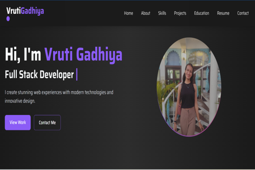

<div align="center">

# 🌐 Developer Portfolio

A modern, responsive, and interactive portfolio built with **React.js**, **Tailwind CSS**, and **Framer Motion** to showcase my projects, technical skills, and academic journey.



[]()
[]()
[]()
[]()

</div>

---

# ✨ Features

- 🎨 Modern & Responsive Design
- ⚡ Smooth Animations using Framer Motion
- 👨‍💻 About Me Section
- 🛠 Technical Skills Showcase
- 📂 Featured Projects
- 🎓 Education Timeline
- 📱 Mobile-Friendly Layout
- 🌙 Clean User Interface

---

# 🚀 Tech Stack

### Frontend

- React.js
- Tailwind CSS
- JavaScript (ES6+)
- Framer Motion

### Tools

- Vite
- Git & GitHub
- VS Code
- React Icons

---

# 📂 Folder Structure

```text
portfolio
│── public
│── src
│   ├── assets
│   ├── components
│   ├── pages
│   ├── App.jsx
│   └── main.jsx
│
├── package.json
├── vite.config.js
└── README.md
```

---

# 🚀 Featured Projects

## 🍔 Tastivo – Food Delivery App

A full-stack MERN food delivery platform with authentication, cart management, order tracking, online payments, and an admin dashboard.

**Tech Stack**

`React` `Node.js` `Express.js` `MongoDB`

---

## 🏠 UrbanStay – Airbnb Clone

A property rental platform with user authentication, property listings, image uploads, and a responsive interface following the MVC architecture.

**Tech Stack**

`Node.js` `Express.js` `MongoDB` `Tailwind CSS`

---

## 🌐 Developer Portfolio

A responsive portfolio website showcasing my skills, projects, education, and resume with elegant animations.

**Tech Stack**

`React` `Tailwind CSS` `Framer Motion`

---

# ⚙️ Getting Started

### Clone the Repository

```bash
git clone https://github.com/vrutigadhiya/portfolio.git
```

### Navigate to Project

```bash
cd portfolio
```

### Install Dependencies

```bash
npm install
```

### Start Development Server

```bash
npm run dev
```

### Build for Production

```bash
npm run build
```
